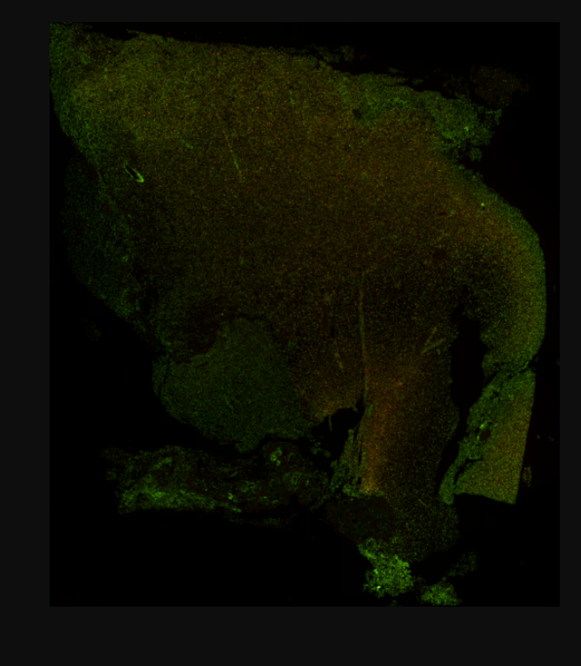

# Spatial Transcriptomics Research

## Introduction
This repository contains all my research related to spatial transcriptomics, focusing on the **gene expression and spot image to protein expression prediction problem** across various tissue samples including brain, breast, and tonsil. The goal of this project is to explore gene expression and protein levels across different spatial spots, leveraging both high-resolution and low-resolution imaging to improve our understanding of spatial biology.

## Datasets
I am working with four different data, each corresponding to different tissue types. Below is a summary of the data sizes for each:

| Tissue   | Spot Size | Gene Expression Size | Protein Size | High-Res Image Size     | Low-Res Image Size      |
|----------|-----------|----------------------|--------------|-------------------------|-------------------------|
| Brain    | 5449    | 17,011                | 31          | (2000, 1744, 3)          | (600, 523, 3)            |
| Breast   | 4164    | 15,687                | 31          | (1957, 2000, 3)          | (587, 600, 3)            |
| Tonsil1  | 4191    | 18,030                | 31          | (1634, 2000, 3)          | (490, 600, 3)            |
| Tonsil2  | 4906    | 18,035                | 37          | (2000, 1743, 3)          | (600, 523, 3)            |

### Example Image

## To-Do List

- **Analyzing Data**
   - [x] Quick analysis
   - [x] Analyzing Data Statistics and creating a presentation about that
   - [ ] Analyzing Spot Metadata

---